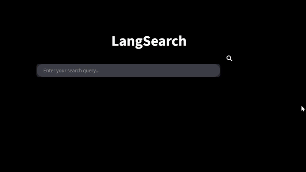

# LangSearch

LangSearch is a Python-based application that leverages the Langchain library along with several other powerful libraries to create an intelligent agent. This agent searches the internet for up-to-date information, provides summarized essays of the results, includes sources, and retrieves relevant images.
### DEMO: (https://langsearch.streamlit.app/)

<div align="center">
  
</div>


## Features

- **Web Search**: Quickly searches for the latest information on various topics.
- **Summarization**: Generates concise summaries of the found content.
- **Source Attribution**: Includes sources for all retrieved information, ensuring credibility.
- **Image Retrieval**: Returns relevant images related to the search query.
  
## Prerequisites

Before running the application, ensure you have the following installed:

- Python 3.x
- Required Python libraries (see Installation section)

## Usage

1. Run the application:

   ```bash
   python langsearch.py
   ```

2. Follow the on-screen prompts to enter your search query.

3. The agent will fetch the latest information, summarize it, and return the results along with images.

## Contributing

Contributions are welcome! If you'd like to contribute to the project, please fork the repository and submit a pull request. 

1. Fork the project
2. Create your feature branch (`git checkout -b feature-branch`)
3. Commit your changes (`git commit -am 'Add some feature'`)
4. Push to the branch (`git push origin feature-branch`)
5. Create a new Pull Request

## License

This project is licensed under the MIT License - see the [LICENSE](LICENSE) file for details.

## Acknowledgments

- [Langchain]: For a powerful interface for creating chain-of-thought agents.
- Other libraries (requests, BeautifulSoup, Pillow) for their respective functionalities.

---
